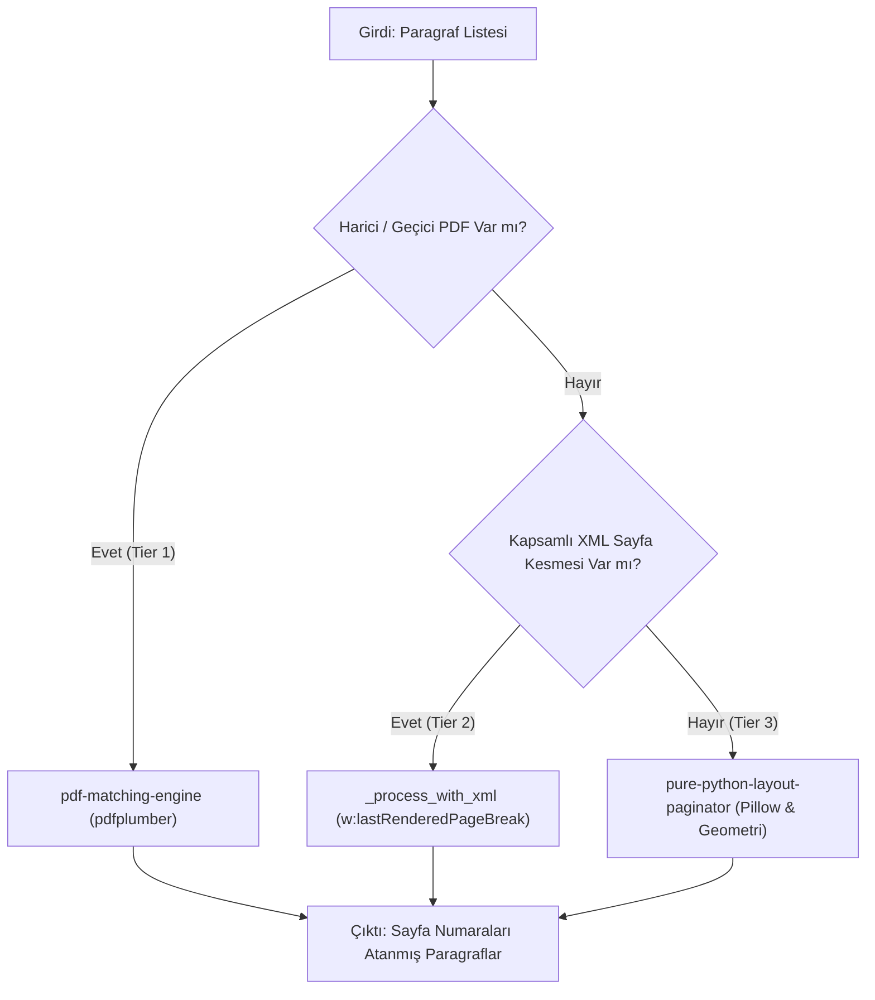

# Modül: DocumentPaginator (Çok Katmanlı Sayfa Koordinatörü)

`DocumentPaginator`, bir Word belgesindeki paragrafların hangi sayfalarda yer aldığını tespit etmek için geliştirilmiş çok katmanlı koordinatör sınıftır (`src/paginator.py`).

Sistemde bulunan araçlara ve kullanıcı girdilerine göre en yüksek doğruluk sağlayan katmanı devreye sokar.

## Çok Katmanlı Sayfalama Hiyerarşisi

## Katmanların Özellikleri

### 1. Kademe (Tier 1) — PDF Eşleme Motoru (`_process_with_pdf`)
- Eğer kullanıcı bir referans PDF verdiyse veya arka planda [[headless-pdf-converter]] ile geçici PDF üretilmişse çalışır.
- [[pdf-matching-engine]] kullanılarak her replik PDF sayfalarıyla eşleştirilir.
- Doğruluk oranı: **%100**.

### 2. Kademe (Tier 2) — OpenXML Soft/Hard Sayfa Kesmeleri (`_process_with_xml`)
- Word dökümanı kaydedilirken Word render motorunun XML içerisine bıraktığı `w:lastRenderedPageBreak` ve `w:br[@w:type="page"]` etiketlerini okur.
- Eğer dökümandaki yumuşak sayfa sonu sayısı yeterli sıklıktaysa (`_has_comprehensive_soft_breaks`) devreye girer.

### 3. Kademe (Tier 3) — Saf Python Mizanpaj Motoru (`PurePythonLayoutPaginator`)
- Sistemde ofis paketi bulunmayan izole ortamlarda yedek simülatör olarak çalışır.
- [[pure-python-layout-paginator]] dökümanın sayfa boyutları, kenar boşlukları ve font metrikleriyle satır sarma simülasyonu yapar.

## `process(paragraphs, pdf_path=None)` Metodu

Koordinatörün ana yürütme metodudur. Parametre olarak gelen paragraflara sırayla yukarıdaki hiyerarşiyi uygular ve `page` alanları güncellenmiş [[parsed-paragraph]] listesini döndürür.

## İlgili Sayfalar

- [[pdf-matching-engine]]
- [[headless-pdf-converter]]
- [[pure-python-layout-paginator]]
- [[adr-002-strict-pdf-pagination-flow]]
